# Git Capstone Project Submission

## Project Title
- Team Collaboration with Git and GitHub

## Team Members
- Morgan
- Jamie

## Repository Setup Summary

### Initial Setup workflows

1. Create Repository
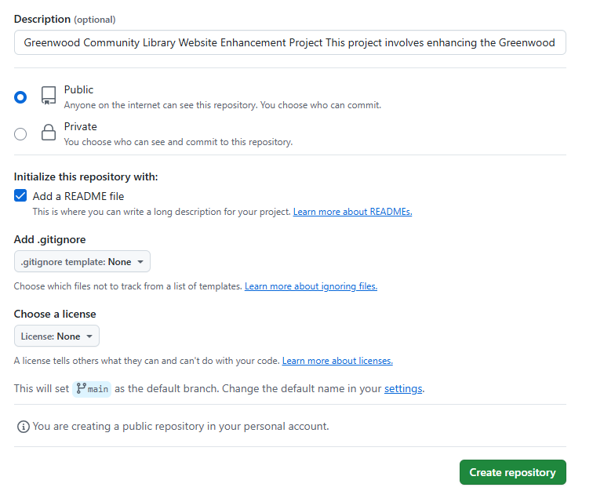

2. Clone Repository
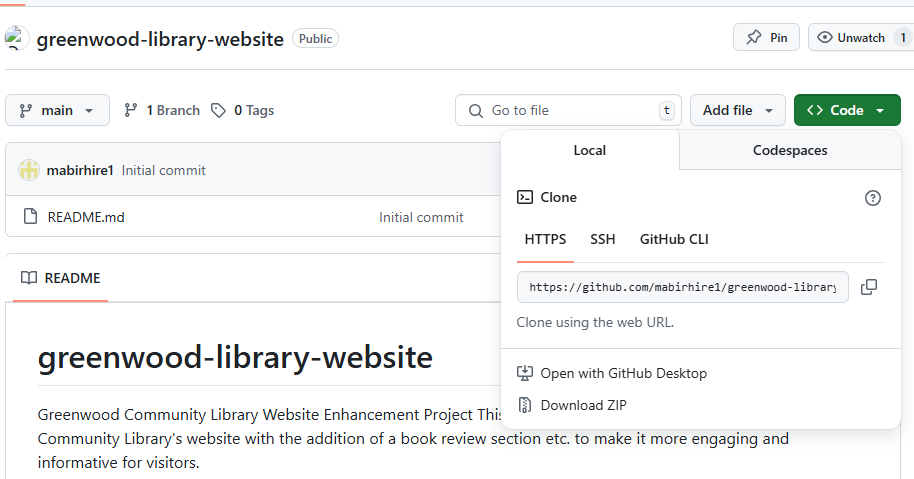

3. Create Codebase Web Pages on Visual Studio Code
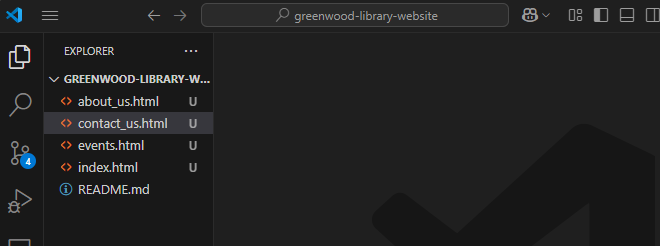

4. Stage, Commit and Push to GitHub
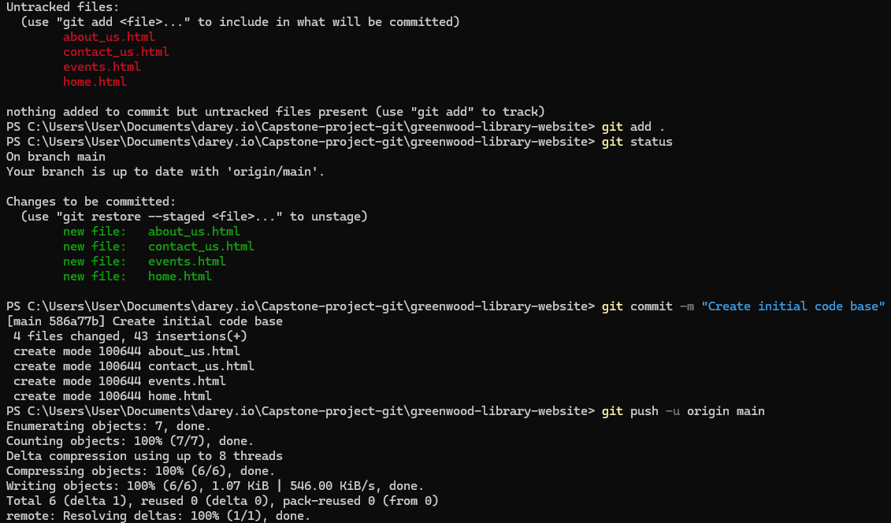

5. Verify Existing Codebase in GitHub
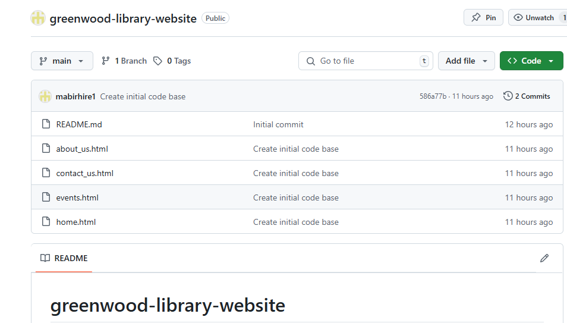

## Branch Workflow Summary

### Morgan's Work: Adding Book Reviews

6. Create Branch, Add Content and Push to GitHub
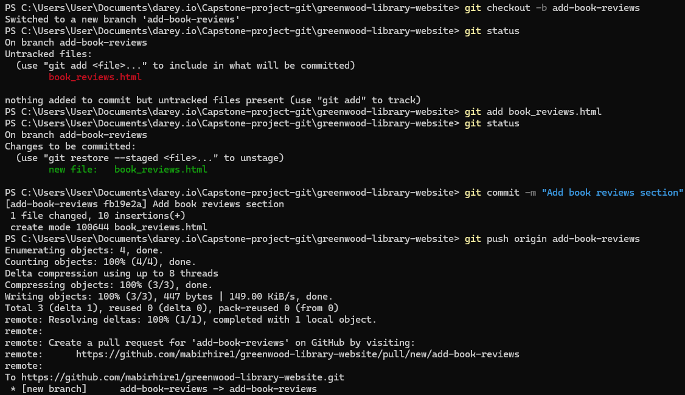

7. Create Pull Request
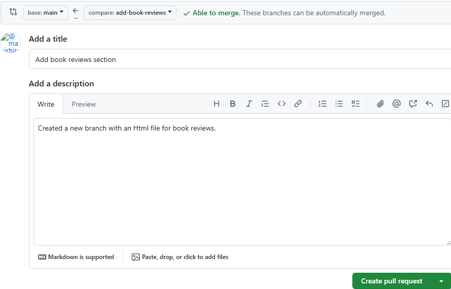

8. Review PR
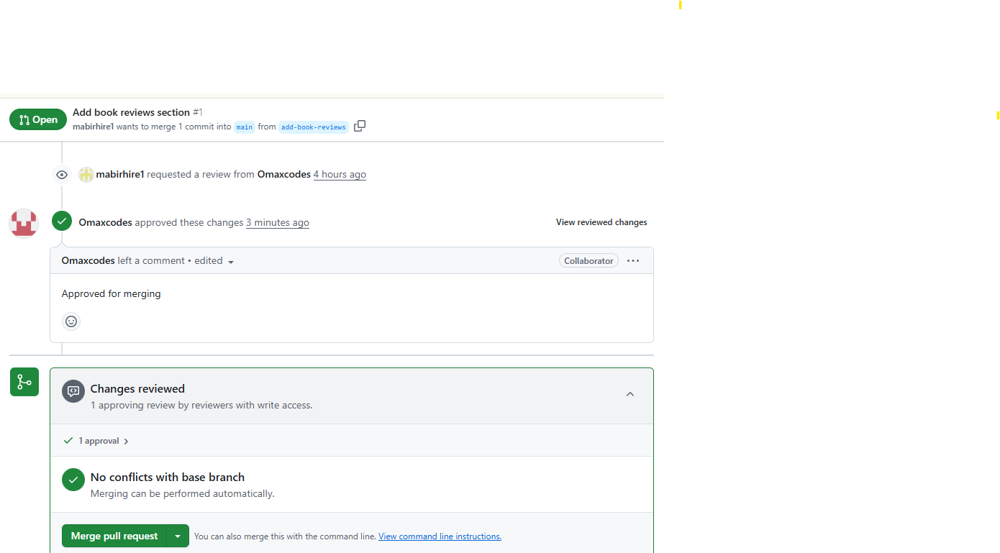

9. Approve and Merge the PR on GitHub
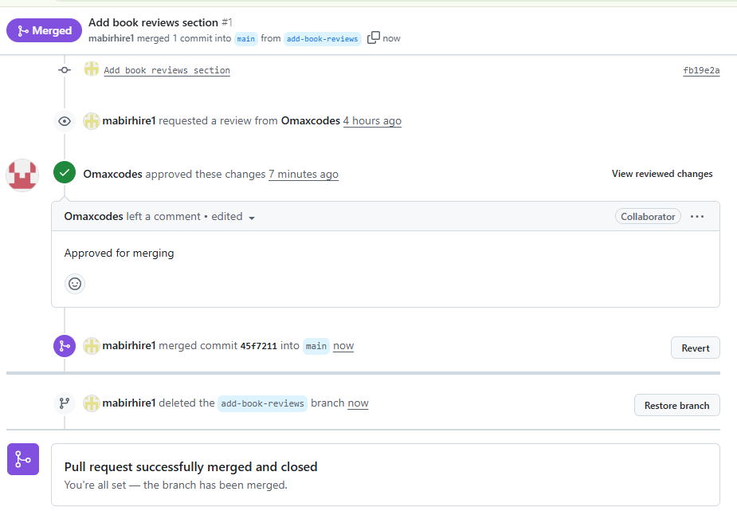

### Jamie's Work: Updating Events Page

10. Create Update Event Branch
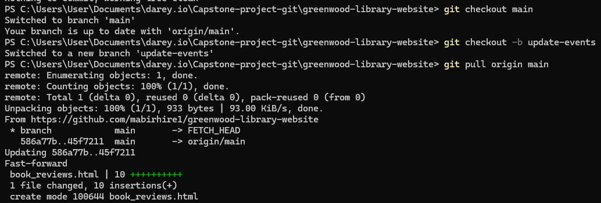

11. Update Event Section
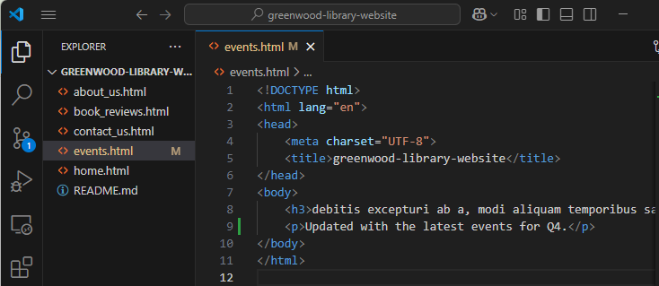

12. Stage and Push to GitHub
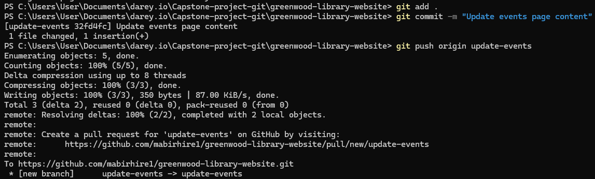

13. Create Second Pull Request
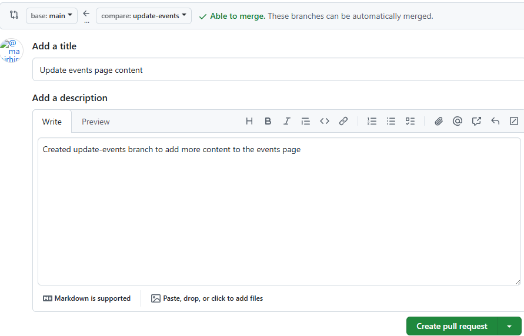

14. Review Changes
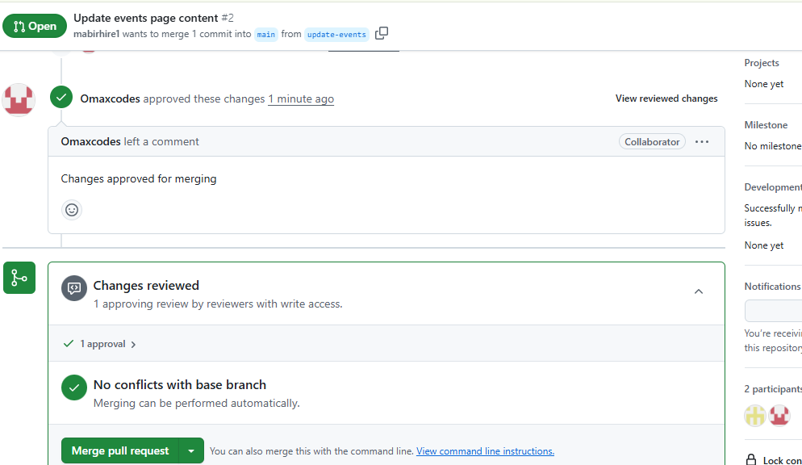

15. Approve and Merge PR
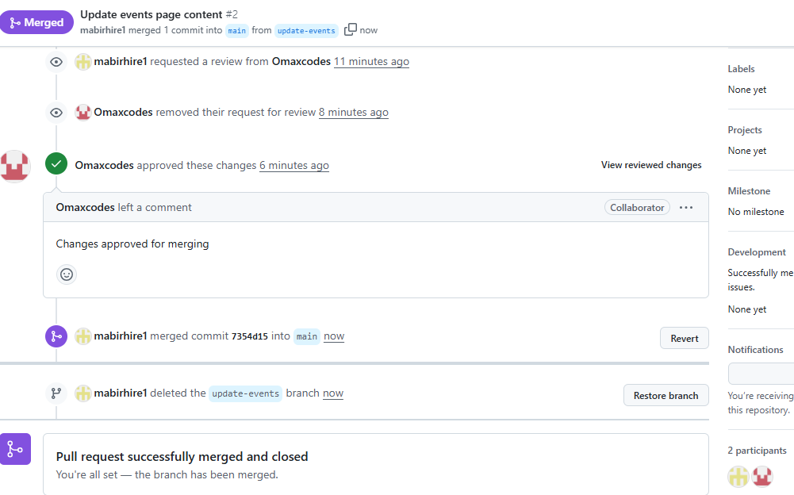

16. Verify Final State of Main Branch on GitHub
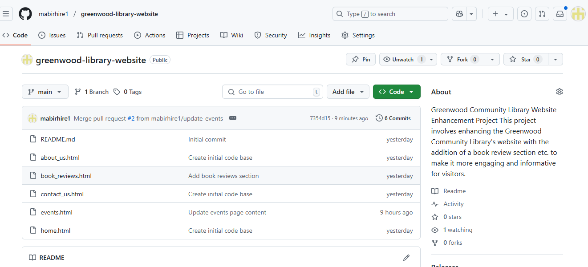

17. Repository Structure on GitHub Showing Merged Branches
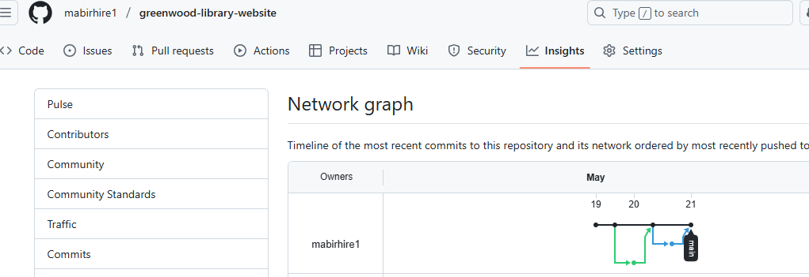

## Pull Request Review & Merging
- Pull Requests were created from feature branches  

- (add-book-reviews and update-events) to main.

- Team members were assigned to review PRs.

- Feedback was addressed where needed.

- All changes were approved and merged into main.

- Feature branches were deleted after merging.

##  Final Deliverables
-  All feature branches created and PRs submitted.

-  PRs reviewed and merged into main.

-  GitHub repository includes:

-  Branch history

-  Commit logs

-  Pull Requests

🔗 GitHub Repository URL: 
[https://github.com/mabirhire1/greenwood-library-website]
